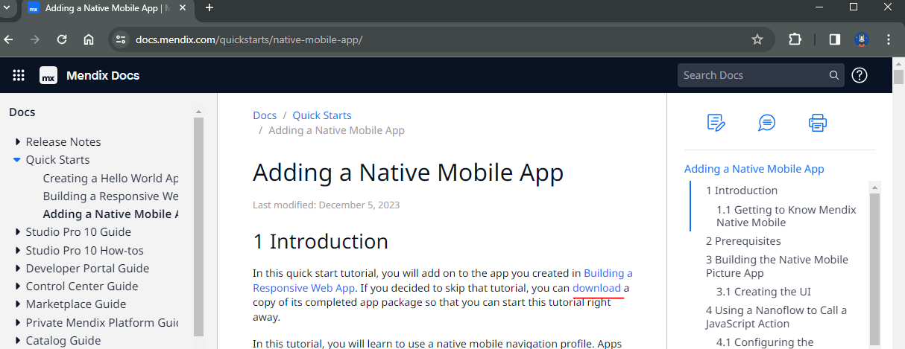
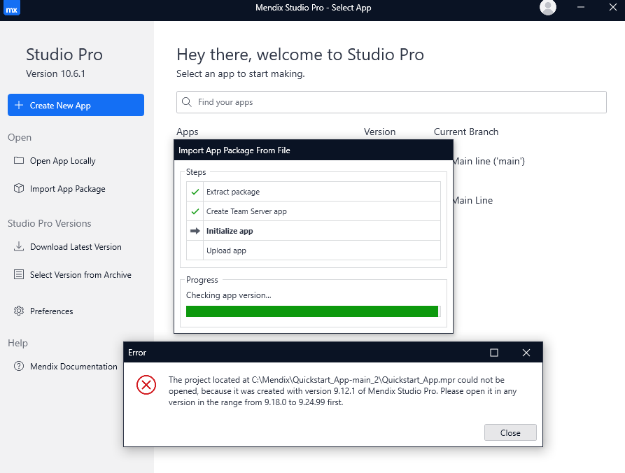
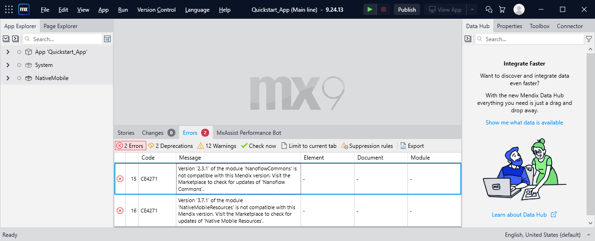
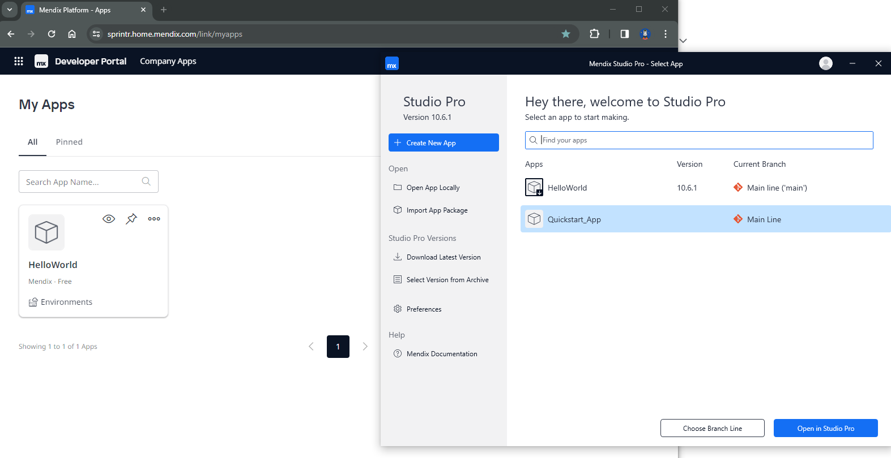

# Mendix Issues

## Low Code Pros vs Cons

More cons than pros

- Very slow: installation (40+ minutes), import, publish
- Very inconvenience
- Not easy to customize
- "Low Code" / "No Code" but the Studio Pro gives us an IDE
- Integrate with Eclipse instead of VSCode or IntelliJ
- ...

## Documents always behind and incompatiable the latest Studio Pro release

2024-01-04

v10.6.1 (Release date: January 4, 2024)

v9.24.13 (Release date: December 27, 2023)

<https://docs.mendix.com/quickstarts/native-mobile-app/>

<https://quickstartguidev1.s3.eu-west-2.amazonaws.com/Quickstart_App.mpk>

bwtween v9.18.0 and v9.24.99

Excuse me? Imported "Quickstart_App.mpk" with v9.24.13 but still has 2 incompatiable errors!

## Big problems on syncing the local Studio Pro and Web UI "My Apps"

- Can only "delete" the apps in Web UI, can't do it in local Studio Pro!
- Local Studio App doesn't have the "refresh" feature - it doesn't sync the apps automatically.
- ...

## "My Apps" should group installed apps with the Studio Pro versions (given the common incompatiable issues)
