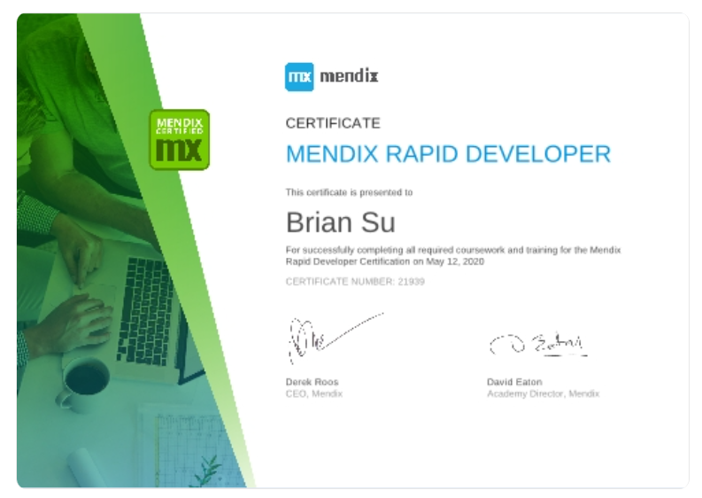

# MyMendix

## My Mendix Credential

- (Mendix) Mendix Rapid Developer
- Issued May 2020
- Credential ID 21939

## My Mendix Project

### Designed and created Mendix applications for client Canada Post

- Talked with multiple legacy application teams and composed the very detailed solution design documents from high level to low level
- Used Mendix Studio to create the responsive and feature-rich UI apps with the low code concept for mobile, pad and computer terminals, deployed the apps to Mendix cloud, built the images with Cloud Foundry, managed the entire application lifecycle, and collaborated with the team with Agile, Scrum and user stories.
- Migrated the business data from various legacy applications to Big Data with the initial load and ongoing delta loads

## My Mendix Udemy Course

WIP

[Mendix Magic: Mobilize Your Responsive Apps with No Code](https://myudemycourses.netlify.app/)

## Mendix Studio Pro

The versions I used

- v10.6.1
- v9.19.0
- v8.18.27

## My Udemy Curses

<https://myudemycourses.netlify.app/>

- [React Mastery: Rapidstart Your Responsive App](https://www.udemy.com/course/react-rapidstart-creating-an-responsive-react-app-in-1-hour/)
- [Struts Savvy: Quickstart Your Java Projects](https://www.udemy.com/course/struts-savvy-quickstart-your-java-projects/)
- [Spring MVC Mastery: Jumpstart Your Java Projects](https://www.udemy.com/course/spring-mvc-mastery-jumpstart-your-java-projects/)
- [Maven Mastery: Kickstart Your Java Projects](https://www.udemy.com/course/maven-mastery-kickstart-your-java-projects/)
- [Ace Your Google Cloud (GCP) Job Interviews](https://www.udemy.com/course/it-contractor-google-cloud-gcp-interview-questions-20xx/)
- [IT Behavioral Interview Questions](https://www.udemy.com/course/it-contractor-behavioral-interview-questions-20xx/)
- [DevOps Interview Questions](https://www.udemy.com/course/devops-interview-questions-20xx/)
- [Efficient Kubernetes Management with Python and Go](https://www.udemy.com/course/managing-dask-kubernetes-with-kubectl-python-and-go/)
- [DevOps Labs: 16 Real DevOps Projects](https://www.udemy.com/course/devops-labs-16-real-devops-projects/)
- [DevOps Labs: 15 Real DevSecOps Projects](https://www.udemy.com/course/devops-labs-15-real-devsecops-projects/)
- [DevOps Labs: 12 Real DevSecOps Projects](https://www.udemy.com/course/devops-labs-12-real-devsecops-projects/)
- [DevOps Labs: 14 Real DevOps Projects](https://www.udemy.com/course/devops-labs-14-real-devops-projects/)
- [DevOps Labs: 9 Real DevOps Projects](https://www.udemy.com/course/devops-labs-9-real-devops-projects/)
