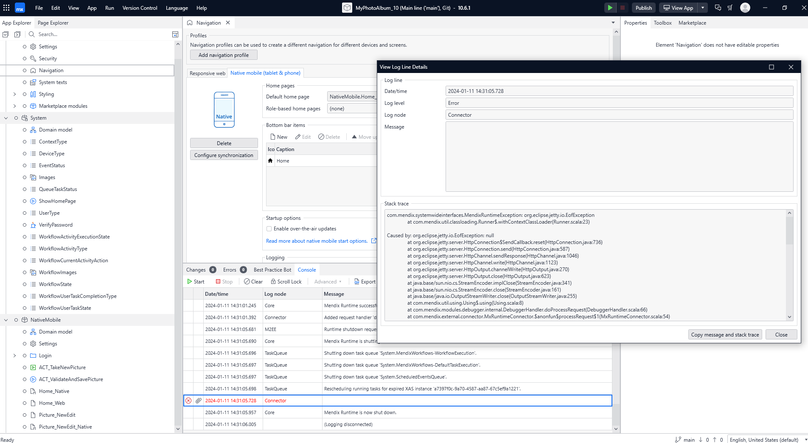
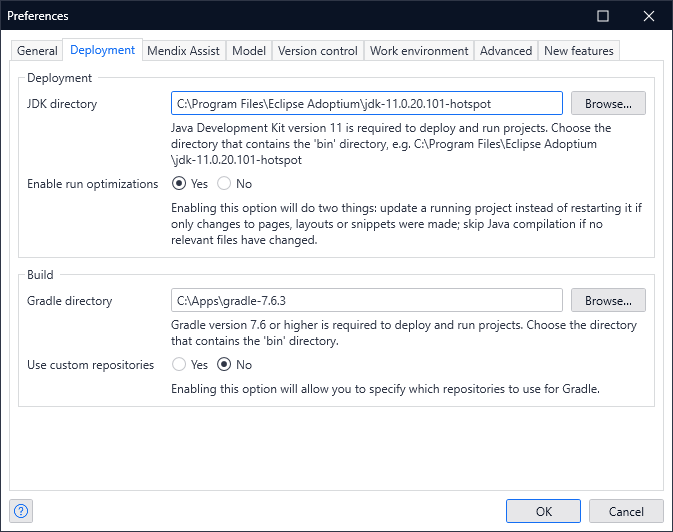

# Native Mobile App Troubleshooting

```text
Error: ENOENT: no such file or directory, open 'C:\Apps\Mendix\10.6.1.24365\modeler\tools\node\node_modules\@react-native-community\cli-server-api\build\index.html'
    at Object.openSync (node:fs:590:3)
    at Object.readFileSync (node:fs:458:35)
    at indexPageMiddleware (C:\Apps\Mendix\10.6.1.24365\modeler\tools\node\node_modules\@react-native-community\cli-server-api\build\indexPageMiddleware.js:32:27)
    at call (C:\Apps\Mendix\10.6.1.24365\modeler\tools\node\node_modules\connect\index.js:239:7)
    at next (C:\Apps\Mendix\10.6.1.24365\modeler\tools\node\node_modules\connect\index.js:183:5)
    at SendStream.error (C:\Apps\Mendix\10.6.1.24365\modeler\tools\node\node_modules\serve-static\index.js:121:7)
    at SendStream.emit (node:events:513:28)
    at SendStream.error (C:\Apps\Mendix\10.6.1.24365\modeler\tools\node\node_modules\send\index.js:270:17)
    at SendStream.onStatError (C:\Apps\Mendix\10.6.1.24365\modeler\tools\node\node_modules\send\index.js:417:12)
    at next (C:\Apps\Mendix\10.6.1.24365\modeler\tools\node\node_modules\send\index.js:759:28)
```

Studio Pro



```text
com.mendix.systemwideinterfaces.MendixRuntimeException: org.eclipse.jetty.io.EofException
 at com.mendix.util.classloading.Runner$.withContextClassLoader(Runner.scala:23)

Caused by: org.eclipse.jetty.io.EofException: null
 at org.eclipse.jetty.server.HttpConnection$SendCallback.reset(HttpConnection.java:731)
 at org.eclipse.jetty.server.HttpConnection.send(HttpConnection.java:582)
 at org.eclipse.jetty.server.HttpChannel.sendResponse(HttpChannel.java:1046)
 at org.eclipse.jetty.server.HttpChannel.write(HttpChannel.java:1123)
 at org.eclipse.jetty.server.HttpOutput.channelWrite(HttpOutput.java:270)
 at org.eclipse.jetty.server.HttpOutput.close(HttpOutput.java:623)
 at java.base/sun.nio.cs.StreamEncoder.implClose(StreamEncoder.java:341)
 at java.base/sun.nio.cs.StreamEncoder.close(StreamEncoder.java:161)
 at java.base/java.io.OutputStreamWriter.close(OutputStreamWriter.java:255)
 at com.mendix.util.using.Using$.using(Using.scala:8)
 at com.mendix.modules.debugger.internal.DebuggerHandler.doProcessRequest(DebuggerHandler.scala:66)
 at com.mendix.external.connector.MxRuntimeConnector.$anonfun$processRequest$1(MxRuntimeConnector.scala:54)
 at com.mendix.external.connector.MxRuntimeConnector.$anonfun$processRequest$1$adapted(MxRuntimeConnector.scala:54)
 at com.mendix.util.classloading.Runner$.withContextClassLoader(Runner.scala:20)
 at com.mendix.external.connector.MxRuntimeConnector.processRequest(MxRuntimeConnector.scala:54)
 at com.mendix.basis.impl.MxRuntimeImpl.processRequest(MxRuntimeImpl.scala:221)
 at com.mendix.m2ee.appcontainer.server.handler.RuntimeServlet.service(RuntimeServlet.scala:40)
 at javax.servlet.http.HttpServlet.service(HttpServlet.java:590)
 at org.eclipse.jetty.servlet.ServletHolder.handle(ServletHolder.java:764)
 at org.eclipse.jetty.servlet.ServletHandler$ChainEnd.doFilter(ServletHandler.java:1665)
 at org.eclipse.jetty.websocket.servlet.WebSocketUpgradeFilter.doFilter(WebSocketUpgradeFilter.java:170)
 at org.eclipse.jetty.servlet.FilterHolder.doFilter(FilterHolder.java:202)
 at org.eclipse.jetty.servlet.ServletHandler$Chain.doFilter(ServletHandler.java:1635)
 at org.eclipse.jetty.servlet.ServletHandler.doHandle(ServletHandler.java:527)
 at org.eclipse.jetty.server.handler.ScopedHandler.nextHandle(ScopedHandler.java:221)
 at org.eclipse.jetty.server.session.SessionHandler.doHandle(SessionHandler.java:1570)
 at org.eclipse.jetty.server.handler.ScopedHandler.nextHandle(ScopedHandler.java:221)
 at org.eclipse.jetty.server.handler.ContextHandler.doHandle(ContextHandler.java:1384)
 at org.eclipse.jetty.server.handler.ScopedHandler.nextScope(ScopedHandler.java:176)
 at org.eclipse.jetty.servlet.ServletHandler.doScope(ServletHandler.java:484)
 at org.eclipse.jetty.server.session.SessionHandler.doScope(SessionHandler.java:1543)
 at org.eclipse.jetty.server.handler.ScopedHandler.nextScope(ScopedHandler.java:174)
 at org.eclipse.jetty.server.handler.ContextHandler.doScope(ContextHandler.java:1306)
 at org.eclipse.jetty.server.handler.ScopedHandler.handle(ScopedHandler.java:129)
 at org.eclipse.jetty.server.handler.HandlerWrapper.handle(HandlerWrapper.java:122)
 at org.eclipse.jetty.server.Server.handle(Server.java:563)
 at org.eclipse.jetty.server.HttpChannel$RequestDispatchable.dispatch(HttpChannel.java:1598)
 at org.eclipse.jetty.server.HttpChannel.dispatch(HttpChannel.java:753)
 at org.eclipse.jetty.server.HttpChannel.handle(HttpChannel.java:501)
 at org.eclipse.jetty.server.HttpConnection.onFillable(HttpConnection.java:282)
 at org.eclipse.jetty.io.AbstractConnection$ReadCallback.succeeded(AbstractConnection.java:314)
 at org.eclipse.jetty.io.FillInterest.fillable(FillInterest.java:100)
 at org.eclipse.jetty.io.SelectableChannelEndPoint$1.run(SelectableChannelEndPoint.java:53)
 at org.eclipse.jetty.util.thread.strategy.AdaptiveExecutionStrategy.runTask(AdaptiveExecutionStrategy.java:421)
 at org.eclipse.jetty.util.thread.strategy.AdaptiveExecutionStrategy.consumeTask(AdaptiveExecutionStrategy.java:390)
 at org.eclipse.jetty.util.thread.strategy.AdaptiveExecutionStrategy.tryProduce(AdaptiveExecutionStrategy.java:277)
 at org.eclipse.jetty.util.thread.strategy.AdaptiveExecutionStrategy.run(AdaptiveExecutionStrategy.java:199)
 at org.eclipse.jetty.util.thread.ReservedThreadExecutor$ReservedThread.run(ReservedThreadExecutor.java:411)
 at org.eclipse.jetty.util.thread.QueuedThreadPool.runJob(QueuedThreadPool.java:969)
 at org.eclipse.jetty.util.thread.QueuedThreadPool$Runner.doRunJob(QueuedThreadPool.java:1194)
 at org.eclipse.jetty.util.thread.QueuedThreadPool$Runner.run(QueuedThreadPool.java:1149)
 at java.base/java.lang.Thread.run(Thread.java:829)
```

C:\Program Files\Eclipse Adoptium\jdk-11.0.20.101-hotspot



- Mendix-9.19.0.55544, 8083 no issues
- Mendix-9.24.13.24168, 8083 has issues
- Mendix-10.6.1.24365, 8083 has issues
